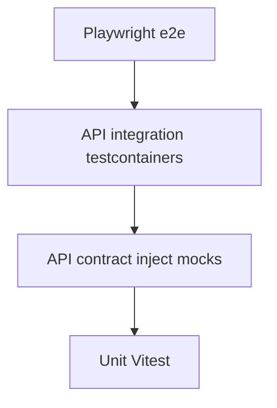

# Testing

How automated tests are organized in this monorepo.

## Pyramid

| Layer | Command | Tool | Database | Notes |
|-------|---------|------|----------|-------|
| Unit + API contract | `pnpm test` | Vitest (+ Fastify `inject` for routes) | Mocked | Default CI job; no Docker |
| Coverage (LCOV) | `pnpm test:coverage` | Vitest v8 | Mocked | Uploaded as CI artifact; fed to Sonar |
| API integration | `pnpm test:integration` | Vitest + **testcontainers** Postgres | Real | Needs Docker; migrate + seed identity in suite |
| UI e2e | `pnpm test:e2e` | Playwright (Chromium) | Real (running API) | Needs API + Vite + seeded DB |



## Local recipes

### Unit / contract

```bash
pnpm test
pnpm --filter api test
pnpm --filter web test
```

### Coverage

```bash
pnpm test:coverage
```

### API integration (Docker required)

```bash
pnpm test:integration
```

Starts `postgres:16-alpine` via **testcontainers** (`@testcontainers/postgresql`), runs migrations, then Vitest under `apps/api/test/integration/`. Requires Docker. Prefer Node **22+** (repo `engines`); CI uses Node 22.

### Playwright e2e

1. Postgres up and migrated/seeded (`pnpm --filter api db:migrate && pnpm --filter api db:seed`)
2. API on `:3100` with `CORS_ORIGIN=http://127.0.0.1:5173`
3. Vite on `:5173`
4. `pnpm exec playwright install chromium` (once, from `apps/web`)
5. `pnpm test:e2e`

Credentials default to `SEED_ADMIN_EMAIL` / `SEED_ADMIN_PASSWORD` (or `E2E_EMAIL` / `E2E_PASSWORD`).

## CI jobs (`.github/workflows/ci.yml`)

| Job | Purpose |
|-----|---------|
| `ci` | lint, typecheck, `pnpm test`, build |
| `coverage` | `pnpm test:coverage`, upload LCOV artifacts |
| `api-integration` | `pnpm test:integration` |
| `e2e` | Postgres service, migrate/seed, API + Vite, Playwright |
| `sonar` | Optional; downloads LCOV and scans when secrets are set |

## What goes where

- **Contract tests** (`apps/api/test/*.routes.test.ts`): status codes, authz, JSON shape — mock services/DB.
- **Integration tests** (`apps/api/test/integration/`): real SQL, login, CRUD that mocks hide.
- **Playwright** (`apps/web/e2e/`): browser journeys (login, open project, edit task, import, reports, logout).
- Do not use Playwright to exhaust API edge cases; put those in contract/integration.

See also [`docs/SONAR.md`](SONAR.md) for coverage → quality gate.
